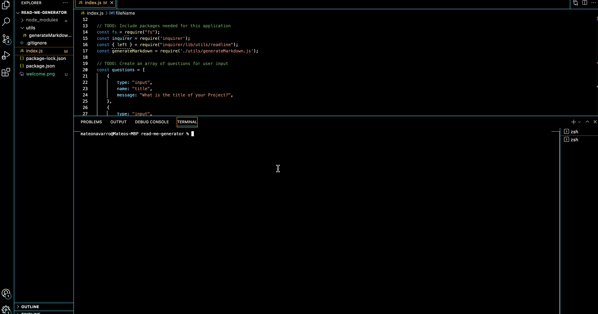

  # README Generator 

  ## Description
  This application allows users to generate a README using javascript and node.js. Include a title, description, visuals, and much more and a readme will automatically be generated for you!

  ## Table of Contents
  - [Visual](#visual)
  - [Installation](#installation)
  - [Usage](#usage)
  - [License](#license)
  - [Contributions](#contributing)
  - [Test](#tests)
  - [Questions](#questions)

  ## Visual 
  

  ## Walkthrough
  Click here for a walkthrough: [here](./walkthrough/readme-generator.gif)

  ## Installation
  Clone this repo and open in IDE of choice. Then open your terminal and navigate to corresponding directory. Type in 'node index.js' and answer the prompts. (Note: you must have node.js and inquirer installed).

  ## Usage
  Once in the appropriate directory, go to your terminal and type in `node.js` into the command line. You will be presented with a series of prompts. Please input into the command line the title of your project, a description, a link to your visual, installation instructions, usage instructions, licensing, contributors, tests, and your contact info. After all the information has been inputted, a readme will be generated for you!

  ## License
  MIT

  ## Contributions
  Mateo Navarro
  
  Github: https://github.com/mateonav98 
  LinkedIn: www.linkedin.com/in/mateonav

  ## Tests
  N/A

  ## Questions
  For further information or any questions please contact me at mateonav98@gmail.com or https://github.com/mateonav98 
